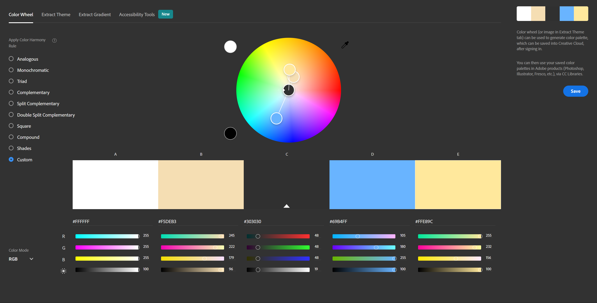
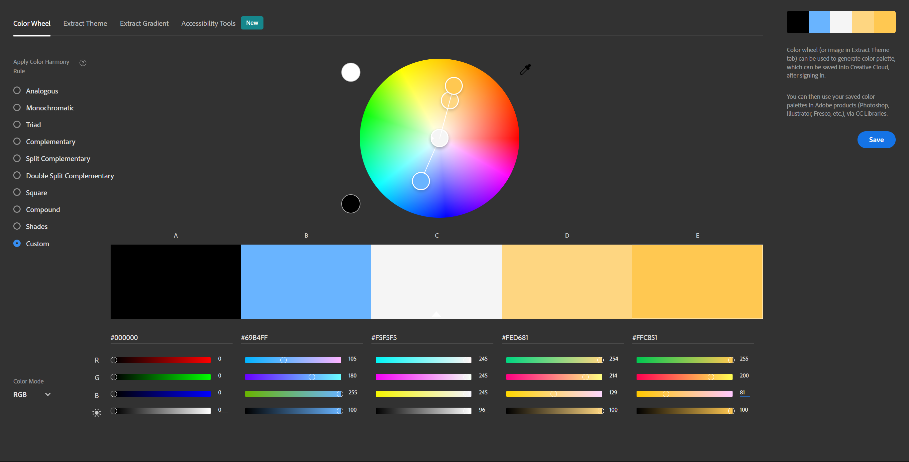

# README

# Hello fellow users! My name is Willard Torres II.

## Project Description (About Me)

The general purpose of the About Me project is to gradually design a website that describes me as an individual throughout the course of a semester. This website would also be improved with additional coding techniques to make the information and content found on the site look nicer and be more accessible to read for mobile users or visually impaired individuals.

## Color Schemes and Templates

--- Text colors Screenshots

Text:

Blocks + Borders:

Body Color: rgb(255, 221, 111)

## Navigation Bar

Navigation Bar is modified to rearrange into a column format upon reaching a maximum page width of 400.

## Citations

Linked video: (https://www.youtube.com/watch?v=XL5Cn8YrEkk&t=1s)
Blog Resources:
(https://wpdatatables.com/css-image-hover-effects/)
(https://blog.hubspot.com/website/css-hover-animation)
(https://www.lambdatest.com/blog/css-hover-effects/)

## Licensing

 This work is licensed under a <a rel="license" href="http://creativecommons.org/licenses/by-nc-nd/4.0/">Creative Commons Attribution-NonCommercial-NoDerivatives 4.0 International License</a>.
